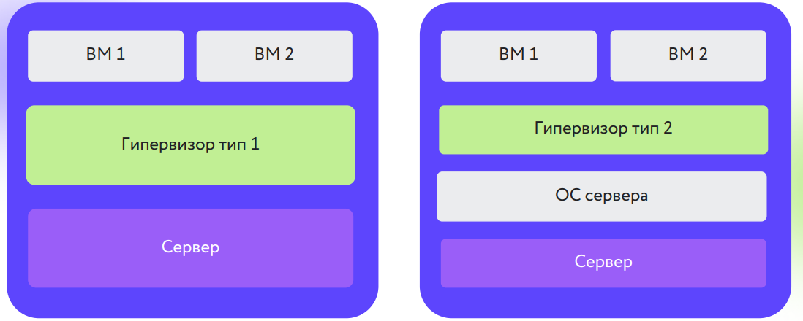

*Предыдущая часть*: [[Как Дима сервер домашний поднимал]]
*Следующая часть*: [[Новое начало]]
*Весь цикл*: [[homeserver_hub]]

Мы возвращаемся к нашей эпопее с домашним сервером, напомню, мы в прошлый раз обсуждали, что такое *виртуализация* - это технология, с помощью которой мы можем на одном устройстве (сервере, ПК и т.д.) разместить множество "виртуальных устройств".

Сегодня мы поговорим о таких вещах, как *контейнеризация* и заденем при этом понятие *гипервизора*.

---

Начнем, пожалуй, как раз с *гипервизора*, кратко, емко, четко:
## Гипервизоры

***Гипервизор*** - программа, позволяющая управлять виртуальными машинами и контейнерами (есть небольшое различие, но об этом дальше). На этом, в общем-то, всё, стоит ещё сказать, что гипервизоры бывают двух типов:

1) *<u>Bare-metal</u>* - т.е. гипервизоры представляющие собой "операционную систему", которая устанавливается напрямую на "железо". Это обеспечивает **наибольшую** производительность и совместимость, но, очевидно, что это сложнее, чем просто поставить VirtualBox)
> Примеры: Proxmox, ESXi, oVirt(и производные)

2) *<u>Hosted</u>* - гипервизор, являющийся натурально программой для уже существующей системы. Такие гипервизоры проще в освоении и используются для пользовательского использования (на винду линукс накатить попробовать).
Меньшая производительность т.к. комплектующие эмулируются для машин, но проще в использовании.
> Примеры: VMWare Workstation, VirtualBox, QEMU/KVM VM Manager.

## Контейнеризация

Как мы уже говорили, очень круто изолировать каждую программу в отдельной машине, отдельный инструментарий и всё такое, но в чем же проблема?

А проблема в том, что мы для каждой программки поднимаем *полноценную (иногда урезанную) ОС*, со своим ядром, своими особенностями и т.д.

И, разумеется, это всё надо питать ресурсами, что дорого, очень дорого, особенно, если у нас отказоустойчивый кластер с *десятками*, а то и *сотнями* машин.

**Какой же выход?** А очень простой, давайте не поднимать для каждой "машины" отдельную ОС с ядром, а использовать одно - которое предоставляет ОС сервера, а приложения запускать в изолированных "окружениях".

> [!info] Пример
> Я не уверен, что смогу объяснить, как это работает, простым языком, но просто представьте, что мы работаем в ресторане и наша задача держать сырье (продукты) в холоде, чтоб те не испортились.
>
> Вот виртуализация, это если мы для каждого ящика с продуктами будем покупать отдельный холодильник, да, это круто, что выход из строя одного холодильника не повлияет на другие, но пипец, как затратно и по деньгам и по электричеству.
>
> С другой же стороны, мы можем выделить целую комнату под холодильник, там наладить централизованное охлаждение и туда уже сгружать ящики с продуктами, вот это контейнеризация, когда мы отдельные ящики охлаждаем общей системой.

К слову, почему я сказал, что гипервизоры для контейнеров и виртуалок отличаются? В сущности, для контейнеров нет как таковой системы, но есть CRI - Container Runtime Interface, то, с помощью чего, контейнеры и запускаются.
ВМ такого не надо, у них у каждой своё ядро. (Но я не хочу разделять понятия, потому что сейчас гипервизоры универсальны и имеют как среду для ВМ, так и CRI)

В общем-то, на этом всё, но напоследок скажу, что в продакшене часто используют смешанный тип, т.е. мы на виртуализации разворачиваем среду для контейнеризации и в машинах разворчиваем контейнеры смежных приложений, так мы изолируем группы программ друг от друга.

Спасибо за внимание, в следующей статье мы уже перейдем к конкретным решениям, которые использую я.
