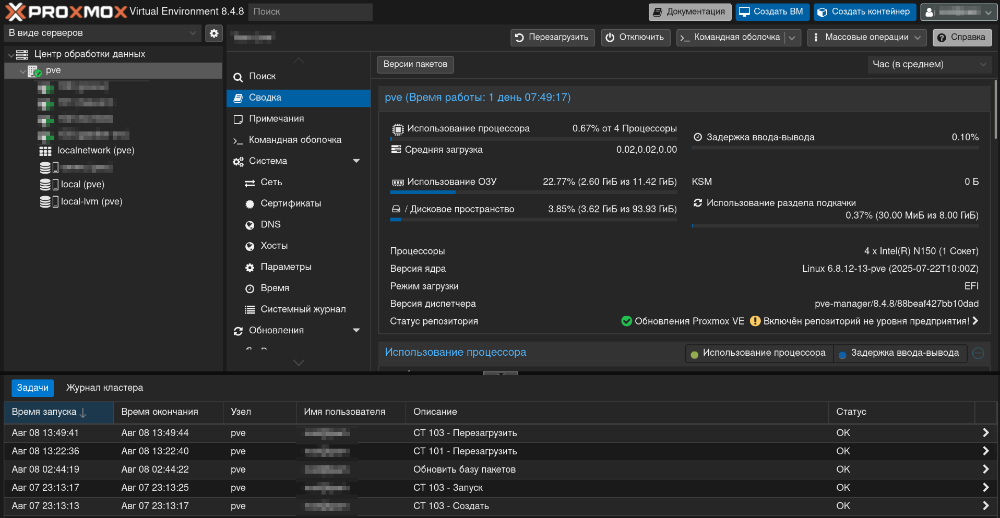
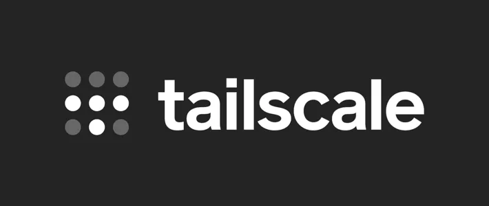
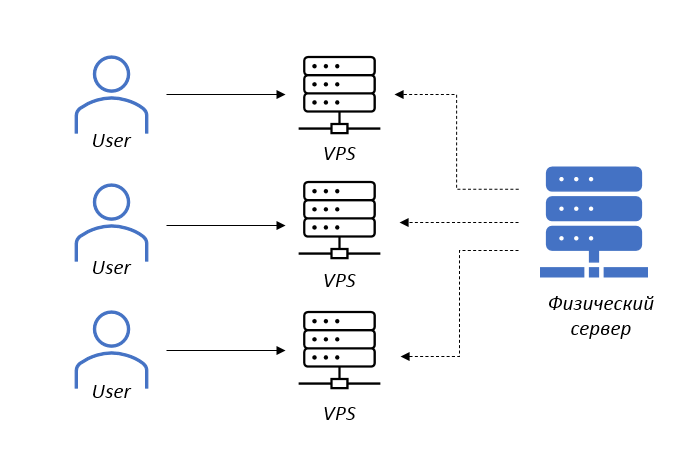
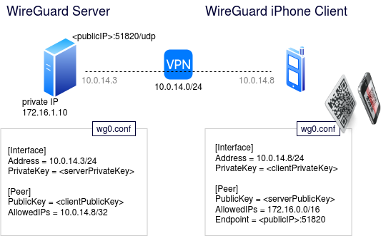

Доброго вечера, коллеги!

Перейдем таки к конкретике:
Изначально, я хотел старый компьютер превратить в сервер (ну вот страсть у меня появилась, ничего не поделать)

Взял я несколько старых ПК, в т.ч. с дачи, вытащил из них всё, что можно вытащить.
Собрал, по итогу, страшную штуку, которую положил себе под кровать в общежитии (поменял ещё кулеры, чтоб не шумел), но надежды не увенчались успехом, соседу не понравился шум ПК(хоть его и не было слышно...). Ладно, подумал было я, сервер, работающий только днем - не сервер.

Отложил я идею, все комплектующие из сервера в основной ПК, все харды (HDD), оперативную память, сделал себе убер-машину.

Прошло пару месяцев и вот я загорелся идеей купить мини-пк (те, что ставят в офисе обычным работника, которым не нужны огромные мощности, но вашна компактность) и на базе него сделать домашний сервер.

Спустя некоторое время поисков, я нашел хороший вариант, а именно - китайский мини-пк с неплохими характеристиками и аж 4-мя слотами под m.2 SSD (потом расскажу, зачем и что это вообще такое)

Значит, недолго думая, я его заказал, он пришел, круто, классно, что дальше?

А дальше, мы начинаем новую главу нашего рассказа:

## Proxmox

Как я уже рассказывал, существует несколько видов [[Коробочки-коробочки...#Гипервизоры|гипервизоров]], мы поставим на наш сервер гипервизор первого типа, т.е. непосредственно на "железо".
Это нам позволяет независимо друг от друга запускать ВМ-ки и контейнеры.
Что такое конкретно ***Proxmox***? Это Open-Source решение для виртуализации, т.е. бесплатное, т.е. разрабатывается открытым сообществом (ну, сейчас уже не совсем, но так или иначе).
Почему именно это решение? Есть oVirt, который тоже бесплатный, но это прям совсем Enterprise решение, там очень много фишек, которые обычному пользователю не нужны, да и Proxmox с этой точки зрения более *коробочное* решение.

Вот как выглядит установленный Proxmox (ну, точнее уже с несколькими развернутыми контейнерами).
Тут вы сможете обнаружить список уже развернутых систем, краткую сводку по системе и много-много другое. Интерфейс слегка страшный, но только на первый взгляд.

Идем дальше, кратко расскажу, как я (и вы) получили доступ к этому сайту (у меня есть ещё несколько, но они скрыты от публики)

Представьте, у вас есть комьютер в домашней сети. У него есть опредлеленный ip-адрес (его ему выдал DHCP-сервер, но об этом в другой раз) формата `192.168.*.*`, это его внутренний ip, т.е. он за NAT'ом

> [!info] NAT
> NAT (Network Address Translation) — это как переводчик между твоей домашней сетью и Интернетом.
> Внутри дома у всех устройств есть свои «внутренние» IP-адреса, которые снаружи никто не видит.
> Когда ты выходишь в Интернет, роутер меняет этот адрес на один «внешний» общий для всей сети.

Если ещё проще, то он просто маскирует твой личный ip под общий для всей сети. Более того, ip твоего роутера тоже не статичный *зачастую*, а динамический, выдаваемый провайдером.

---

Итого, у нашего сервера постоянно меняющийся ip, к которому мы не можем обращаться из интернета (это круто, да, безопасность, но вопрос об удаленном доступе уходит сам собой:)).
Что делать? Вариантов несколько, но практически везде, кодовое слово "*туннель*":

1) Tailscale - это готовое решения для создания виртуальной локальной сети (каждому устройству в сети выдается "виртуальный ip")

***Плюсы***: Быстро, бесплатно, почти автоматически.
***Минусы***: Никакой гибкости, решение только для индивидуального доступа (вот такой сайт не сделать), безопасность перекладывается на внешнего вендора.

---

1) VPS - сервер
 **Решение**: Мы покупаем маленький внешний сервер у провайдера (в моем случае Timecloud.Web, *не реклама*, у них явно маркетинг не на мой канал направлен), у него есть белый IP.
Что дальше? А дальше, мы поднимаем на этом VPS "обратный прокси", т.е. веб-сервер, но который не сам по себе будет выводить картинку, а "переадресовывать" запросы пользователя на наш внутренний сервер.
 ***Плюсы***: Гибко, интересно.
 ***Минусы***: Стоит денег, сложно в настройке, безопасность ложится на нас.

> VPS (Virtual Private Server) — это как отдельный «компьютер» внутри большого компьютера, который тебе сдают в аренду.

---

Как вы понимаете, я - мазозист и выбрал VPS (ну, ещё мне нужен был вывод сайта в публичное поле).

Но вот проблема, наш VPS точно так же не видит наш сервер, что делать? ТУННЕЛЬ!

Мы поднимаем буквально VPN (Virtual Private Network) - проще говоря, делаем такой же tailscale, но сами)

Вот поднимаем туннель, т.е. зашифрованное соединение между двумя клиентами (peer2peer), они друг друга видят, притом VPS может свободно обращаться устройствам внутри сервера, что нам и нужно.

Не буду углубляться в детали происходящего, но я использую WireGuard, как туннель.

Притом, что удобно, мы этот самый WG используем и как способ защиты от нежелательных гостей, ведь мы можем настроить наши сайты так, чтобы они пускали к себе только пользователей, которые тоже являются участниками это приватной сети. Кайфы, да?
Отвечу за вас, да!

У нас есть классный способ "проникать" на наши ресурсы, притом четко разграничивать доступы (вы этот сайт видите, а некоторые не видите).

Последнее, что я опишу в этой огромной статье - это домен - dg.ada-dev.ru (dg - digitalgarden).
В данном случае, это поддомен домена ada-dev.ru, который зарегистрирован на меня в том же TimeCloud.Web.
На него я выписываю сертификаты, поэтому на вас не ругается браузер, когда вы заходите на этот сайт по http**s**, что делает наше с вами соединение безопасным)

На этом на сегодня все, рассказывайте, что было понятно, что не понятно, что пояснить, куда что добавить и о чем сделать следующую статью:
1) Продолжаем про сервер
2) Поговорим о сторонних вещах (DNS, DHCP, или что-то ещё)

