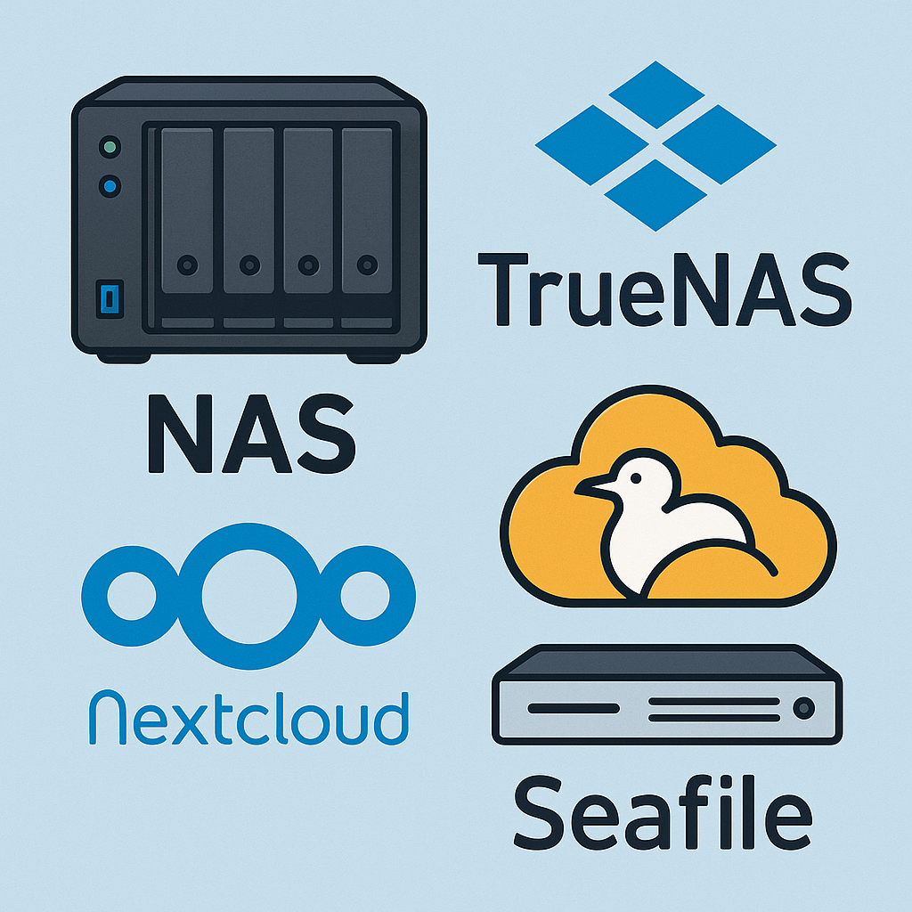
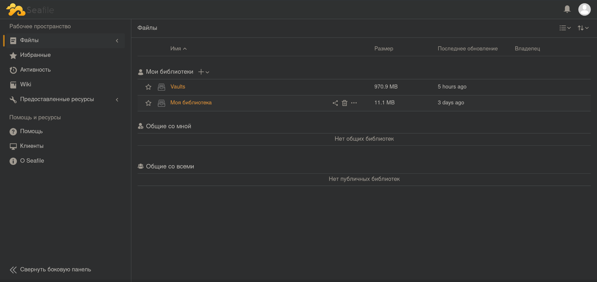
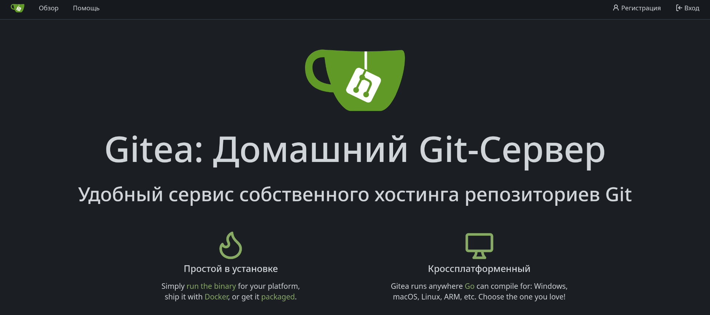
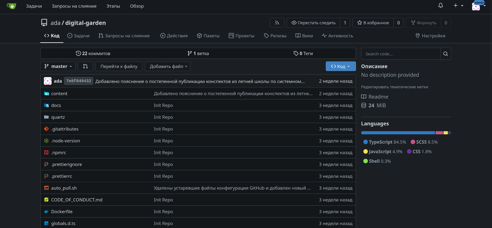
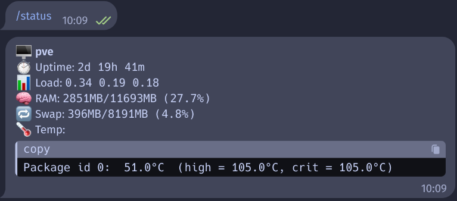

*Предыдущая часть*: [[Новое начало]]
*Весь цикл*: [Домашний сервер]({{ site.baseurl }})

И вновь доброго времени суток, друзья!
После некоторого времени моего отсутствия, мы продолжим разбирать по полкам домашний сервер.

Начнем мы вообще с простого вопроса: "*А зачем?*"
- Да, конечно, вот мы с вами разобрали техническую составляющую, программную, но зачем это всё? Зачем разбираться с виртуализацией, контейнерами и так далее, если можно просто пользоваться тем, что уже есть? А, кстати, что есть?

## Зачем нужен домашний сервер?

Разумеется, мне сервер нужен не просто, чтобы он стоял (хотя он красивый, конечно).
Мы ежедневно пользуемся огромным количеством сервисов (мессенджеры, хостинги, облака), но у них у всех есть небольшая проблема — за них, зачастую, надо платить, но это не всегда главная проблема. Главной же проблемой я вижу приватность: приватный репозиторий GitHub далеко не всегда гарантирует безопасность, а частота утечек данных из облаков это вообще уже мем.

Поэтому логичным решением становится использование локальных решений (NAS, Git-сервер). Ну и, разумеется, никуда без самохостинга (развертывание своих проектов на локальном железе) и обучения с экспериментами.

## Основные сервисы для домашнего сервера

### NAS - Network Attached Storage
Представьте, вот вы сидите такой молодец, у вас есть туча фоточек и видео с моря и вы о-о-о-о-чень хотите их хранить у себя дома на жестком (например) диске.

Всё круто, вы их перекидываете на компьютер с телефона, рассортировываете по папкам, по датам и всё вообще красиво. Но вот проблема: вы поехали на встречу с друзьями и хотите показать эти фотки, но с телефона вы их уже удалили — зачем место занимать, они ж лежат дома. Что делать? NAS!

**NAS - Network Attached Storage (англ. Сетевое хранилище данных)** — это оборудование (часто, сервер), которое подключено к локальной (а порой и глобальной) сети, обеспечивающее доступ к данным на этом сервере с других устройств. Самая простая аналогия — это *сетевая папка в проводнике Windows*.
Формально, это просто компьютер, цель которого — *хранить и передавать данные*.

Существует большое количество уже готовых решений, но я бы выделил такое явление, как ***TrueNAS*** — это операционная система для разворачивания своего NAS-сервера. То есть это как Proxmox, но не для виртуализации, а для удобной работы с хранилищем данных.
В TrueNAS, кстати, есть встроенное ПО для создания RAID-массивов. Про них подробнее можно почитать здесь: [[RAID — Redundant Array of Independent Disks]]

### Веб-интерфейсы для NAS

В довесок к этому, мало кому будет удобно работать с файлами постоянно через консоль (ssh, scp, rsync и т.д.) — мы же любим интерфейсы!
Поэтому здесь открытое сообщество тоже нас не обделило возможностями:
1) **NextCloud** — полнофункциональное облачное решение
2) **Seafile** — легкое и быстрое файловое хранилище
3) И ещё туча веб-интерфейсов, разворачиваемых как нативно (прямо в системе), так и через Docker (в контейнере)

Такие решения могут предоставлять не только веб-интерфейс для работы, как с Яндекс.Диском, но и онлайн-офис, как, например, Google Docs, Sheets...

Я для своего "облака" использовал **Seafile**, так как он менее нагруженный всякими дополнительными приложениями и т.д.
Да и у них есть свой клиент под все системы — считай, реально замена Яндекс.Диска (кстати, графического интерфейса у ЯД под Linux нет, а тут есть).

Да, вы можете сказать, что оплатить подписку на ЯД не сильно дороже выйдет, чем покупать физические диски, но я с вами не соглашусь.
Оплачивая подписку, вы покупаете не только мощности, но и защиту от падения, утечек и тому подобное. Вы не отвечаете за это, и порой это выходит боком. Сервер Яндекса лег? Ну что поделать, жди. Твой сервер лег? Ну ты молодец, че)
Да и... скорость загрузки на своем сервере, зачастую, выше просто из соображений отсутствия нагрузки на сеть со стороны других пользователей.

### Git-сервер
Тут не буду сильно распинаться, многие из вас знают такую волшебную вещь, как git. Кстати, давайте поясню, в чем разница между git и GitHub, раз уж на то пошло.
> [!info] Git VS GitHub
> Вообще, есть очень хороший и доходчивый пример по этому поводу, но он неприличный, поэтому иначе:
> Git - это инструмент версионирования, работающий локально у вас на комьютере. Никто вам не мешает, например, сохранять историю версий Word-документа, т.е. это просто программка, которая следит за изменениями конкретного файла или файлов, но тогда это уже называется репозиторием.
> Github - это хостинг, соц.сеть для программистов, если угодно), место, где хранятся эти самые репозитории.
> Проще говоря, git - это фотоаппарат, на который делаются фотки (репозитории), а github - это как моментальнограм (запрещенная в РФ соц.сеть), где все эти фотки хранятся.

Зачем разворачивать локальный хостинг репозиториев? Хз, спросите у компаний, которые вообще никогда не будут пользоваться GitHub, а разворачивают локальный git-сервер (как правило, GitLab за его функционал).
Кроме шуток, это, конечно, приватность. Гораздо безопаснее, когда твой код (а в IT-компаниях код == продукт) хранится у тебя же на сервере (так сказать, on-premise), а не где-то там в Америках (да, знаю, что сервера GH не только там, но сути не меняет).

### Выбор Git-сервера

Я для своих целей взял, конечно, не GitLab — это тяжелое и очень мощное решение со своей системой секретов, удобным интерфейсом, встроенным веб-IDE и, за что GL очень любят — уникальной и мощнейшей системой для **CI/CD**\*.

> [!note] Что такое CI/CD?
> CI/CD — это автоматизация работы с кодом.
>
> - CI (Continuous Integration, непрерывная интеграция): каждый раз, когда программист коммитит код, система автоматически:
>   - собирает проект,
>   - запускает тесты,
>   - проверяет, что всё работает.
> - CD (Continuous Delivery/Deployment, непрерывная доставка/развёртывание): если всё прошло успешно, система автоматически выкатывает новую версию на сервер или готовит её к выкладке.
>
> Аналогия:
> - CI = проверка блюда на кухне (дегустация, чтобы не было ошибок).
> - CD = подача блюда клиенту в зале (быстро и без лишней ручной работы).

Для себя я развернул сервис **Gitea** — это легкий самодостаточный git-сервер со всем необходимым функционалом.

<small>*К тому же, очень красивый)*</small>

Вот пример репозитория в Gitea — ничего не напоминает?)

При этом в нем тоже есть небольшой инструментарий CI/CD в виде вкладки "Действия", хотя тут скорее CD конкретно. (Это аналог GitHub Actions).

## Дополнительные сервисы

Я ещё упомянул мессенджер, но пока до него не дошел, поэтому ничего не расскажу — да и необходимости прям такой нет.

С другой стороны, у меня несколько контейнеров подняты исключительно под ТГ-ботов, торговых ботов (про которых, кстати, скоро будет тоже пост). На самом сервере ещё развернут простенький бот для псевдо-мониторинга показателей сервера.

---

## Итог

В завершение хочу сказать, что домашний сервер/лаборатория — это, в общем-то, скорее игрушка, поле для экспериментов. Но! Как сказал один умный блогер на ЮТ: "Если вы не знаете, зачем вам дома сервер, то вам не нужен дома сервер)". И я с ним согласен — этим надо проникнуться.

От себя я могу порекомендовать попробовать поднять когда-нибудь свой NAS, потому что в любом случае у каждого есть галерея фоток, которую хочется сохранить, а облако могут закрыть внезапно. Диски же спокойненько лежат на полочке и им хорошо)

### Что дальше?

Я могу рассказать про способы хранения данных (далеко не всегда используются диски — зачастую под большое и долговременное хранение используются ленточные хранилища). Интересно?

На этом я заканчиваю статью — пользуйтесь только надежными сервисами, а я помогу вам в выборе!

