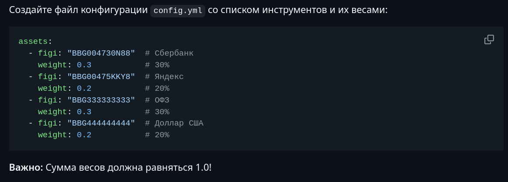

# 0. Предисловие

Каждый раз, когда человек задумывается о том, что надо бы начать откладывать деньги на "будущее", встает миллион и один вопрос, касательно того куда откладывать, сколько откладывать и будет ли это вообще иметь какой-то смысл? Далее человек доходит до выбора между хранения средств в свинье-копилке дома, на накопительных счетах / вкладах, а в особенно исключительных случаях, смотрит в сторону инвестиций. Однако же, зачастую, все это заканчивается примерно так:

Но если вы уже решительно захотели начать откладывать деньги, то тут варианта основных два:
1) Активные вложения (поиск выгодных вариантов, постоянное реинвестирование, исследование рынка и так далее до бесконечности)
2) Пассивные вложения - и вот тут надо остановиться подробнее

Вообще говоря, активное инвестирование - это, конечно, все круто весело и интересно, но не у всех есть время изучать теорию и тратить ежедневно время на изучение новостей, стаканов там всяких или просто ежемесячно искать новые вклады и счета (ну или открывать промо-вклады в разных банках) )
А вот найти и оборудовать себе способ пассивного дохода - это прям искусство и каждый тут находит свои варианты. Я хочу рассказать про свои.

# 1. Теоретический минимум

## 1.1. Инвестиции
Рассказывать про пользу инвестиций и углубляться в экономическую теорию я, разумеется, не буду (не имею должной компетенции, да и времени особо нет). Но про основные инструменты инвестиций небольшую справку приведу:

Для инвестиций существуют несколько базовых инструментов (не углубляясь во всякие фьючерсы и другие):
1) Вклады и накопительные счета - самый просто способ "заставить деньги работать" - вы даете деньги банку, он вам платит процент за использование, всё ровно, прозрачно.
2) Акции - "доли" компании, которые вы можете приобрести, например, у брокера (Т-Инвестиции, Альфа-Инвестиции, и т.д. и т.п.).
   Такой актив является наиболее популярным, может приносить дивидендный доход (если компания их выплачивает), но, как правило, их покупают в надежде на рост компании.
3) Облигации - "обязательства", когда вы даете взаймы компании/государству, а они, в свою очередь, обязуются вам выплатить тело кредита и проценты к нему (как-будто банком становитесь на время).
4) **ETF** (_exchange-traded fund_) — биржевой фонд. Покупая пай, вы приобретаете «кусочек» большого портфеля из акций, облигаций или других активов. Это простой способ диверсифицироваться и не собирать портфель вручную.

> Инструментов, повторюсь, сильно больше, но это ж минимум, значит, минимально.

## 1.2. Стратегии

Я лично использую Т-Инвестиции (не реклама, просто и банком пользуюсь), как брокера, поэтому буду рассказывать с его точки зрения.
У многих брокеров есть такая фишка, как стратегии и авто-следование, когда вы повторяете сделки более опытных инвесторов и получаете за это доход (при этом достаточно пассивно), но, конечно, платите им копеечку, они ж молодцы.

Одной их таких стратегий является DCA:
> DCA (Dollar Cost Averaging) — это инвестиционная стратегия, при которой вы регулярно покупаете финансовые инструменты на фиксированную сумму, независимо от их текущей цены. Это помогает снизить влияние волатильности рынка на общую стоимость инвестиций.

Т.е. условно у меня каждый месяц есть n-ая сумма свободных средств, а закидываю их на счет и покупаю активы на эту сумму, независимо от их стоимости.
Так вы усредняете цену входа и снижаете влияние резких колебаний рынка. Это не панацея, но позволяет спокойно инвестировать без попыток «угадать дно».

# 2. T-Invest API

К слову говоря, у Т-Инвестиций относительно недавно появился очень хороший API для работы со счетами у брокера.
Если вкратце, то это библиотека для Python, позволяющая получать доступ к инвестиционным счетам, включая, но не ограничиваясь:
1) Вывод списка активов на конкретном счете
2) Вывод списка счетов и их ID для пользователя
3) Покупка/Продажа активов по FIGI

Возможностей очень много, но вот именно такие атомарные действия позволяют нам писать самые разнообразные алгоритмы, от самых простых, до сложнейших торговых ботов, торгующий с помощью модели ИИ.

# 3. Мои боты

Я в факультативном формате изучал [документацию](https://www.tbank.ru/invest/open-api/?ysclid=mfzhnexp1h882107989) T-Инвестиций, которая, кстати, весьма неплохо написана. Написал пару ботов, некоторых смог доработать до неплохих, при этом, простых проектов, которые могут помочь начать инвестировать любому человеку.

## 3.1. DCA-бот
Как понятно из теории и названия, это бот, который использует стратегию DCA для торговли.
У меня это работает так: я настроил автоматический перевод с основной карты на инвестиционный счет фиксированной суммы в месяц, в этот же день на моем мини-сервере запускается (с помощью cron) этот скриптик, который автоматически покупает прописанные заранее активы, с заранее выставленными весами. (разумеется, не обязательно, иметь сервер, чтоб на ноутбуке запустить раз в месяц скрипт)

Бот по токену API получает доступ к счету и закрывает позиции.
Главная проблема - не всегда это число выпадает на будний день, а в выходные многие активы просто не торгуются и бот может выпасть слегка.

Я весьма неплохо (с помощью ГПТ) расписал README на GitHub, поэтому, если интересно попробовать такого бота в своей практике для автоматизации инвестирования (советую начать с ETF, т.к. там стомость пая минимальна, что позволяет ловко указывать веса)

Ссылка на проект на GitHub: https://github.com/ada-dmitry/dca_bot_tinv

## 3.2. Mirror-бот

Как следует из названия, этот бот просто зеркалирует сделки, но что именно происходит?
У вас, допустим, есть два счета, один из которых используется для экспериментов, другой для основных вложений.
Но, очевидно, что вручную дублировать сделки - дело тухлое весьма (да и с учетом человеческой реакции, цены будут различаться).
Для решения такой проблемы, есть такой бот, который в автоматическом режиме мониторит master-счет и с заданным коэффициентом дублирует сделки на slave-счет.

Там тоже неплохая документация, так что рекомендую к прочтению:
https://github.com/ada-dmitry/mirror_bot_tinv

# 4. Заключение

Статья получилась не сильно длинной, но самая важная мысль, которую я бы хотел донести - это важность инвестиций, даже самых небольших, т.к. вложения 5-10% ежемесячного дохода не сильно нанесут потери вашему бюджету, зато у вас будет некоторая финансовая подушка.
Надеюсь, мои способы помогут начать и не забить на эту идею слишком быстро (т.к. методы полупассивные)
И, конечно же, это все не является индивидуальной инвестиционной рекомендацией, вы сами отвечаете за свои действия.

Хорошего времени суток и до скорого!